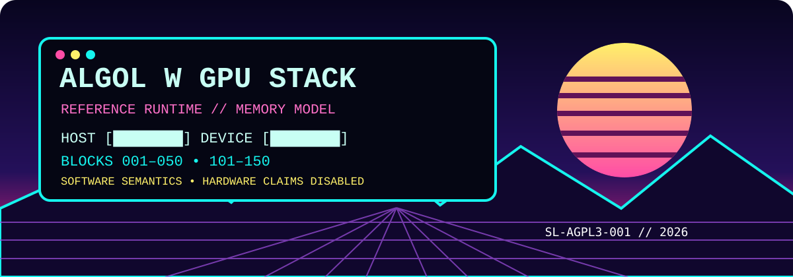
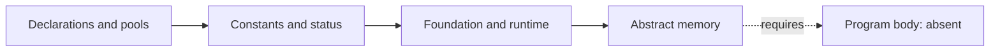
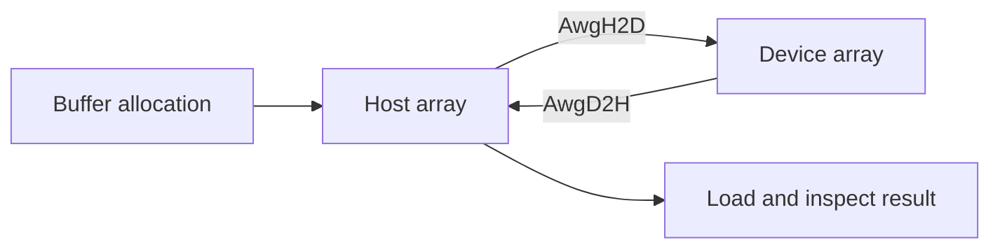

# ALGOL W GPU Stack




[](LICENSE)

> An ALGOL W software model of GPU-style runtime and memory concepts, with
> explicit hardware boundaries and individually identified source nodes.

The current checkout contains a declaration head and three implementation
fragments: constants, foundation/runtime, and abstract memory. It does not yet
contain a complete 500-block stack or an executable program body. The 108
procedure definitions include two self-test procedures; neither has been run
with a native ALGOL W compiler.

## Release Status

The first tagged source release is `v0.1.0`. It packages the licensed declaration
head, constants, foundation/runtime, abstract-memory fragment, documentation,
node manifest, and block index. This is a source preview: the missing
`src/AwgBody.alw` prevents an assembled program, and native execution remains
unverified.

## Table of Contents

1. [What This Is](#what-this-is)
2. [Why ALGOL W](#why-algol-w)
3. [Full Architecture Overview](#full-architecture-overview)
4. [Layer 1 — Foundation and Runtime](#layer-1--foundation-and-runtime)
5. [Layer 2 — Abstract Memory](#layer-2--abstract-memory)
6. [GPU Concept Mapping](#gpu-concept-mapping)
7. [Memory Pipeline Flow](#memory-pipeline-flow)
8. [Hardware Backend Strategy](#hardware-backend-strategy)
9. [Building and Running](#building-and-running)
10. [Limitations and Future Work](#limitations-and-future-work)
11. [Determinism and Reproducibility](#determinism-and-reproducibility)
12. [Contributing](#contributing)
13. [Block and Node Index](#block-and-node-index)
14. [License](#license)
15. [Release Status](#release-status)

## What This Is

This project expresses status handling, record descriptors, register-like state,
array-backed memory spaces, addressing, allocation, copies, views, and runtime
initialization in ALGOL W. Host and device storage are arrays in the reference
program. Their names describe the software model; they do not establish GPU
execution or allocation in GPU VRAM.

## Why ALGOL W

The supplied implementation uses ALGOL W records, arrays, procedures, and explicit
parameter modes to describe the model. The language and module boundaries are
specified in [the contract](docs/LANGUAGE_AND_MODULE_CONTRACT.md). Computational
source remains ALGOL W.

## Full Architecture Overview



| Assembly order | File | Contents |
|---|---|---|
| Head | [AwgHead.alw](include/AwgHead.alw) | Opens the unit; scalar declarations, record classes, pools, IR and scratch arrays |
| 000 | [000AwgConstants.alw](src/000AwgConstants.alw) | Status reporting, counters, codes and capacities |
| 001 | [001AwgFoundation.alw](src/001AwgFoundation.alw) | Integer helpers, handles, descriptors, initialization and foundation self-test |
| 101 | [101AwgMemory.alw](src/101AwgMemory.alw) | Software memory operations and memory self-test |
| Body | `src/AwgBody.alw` | Not supplied |

`src/ALGOL_W_GPU_STACK_COMPLETE.alw` is a placeholder carrying a license notice,
not an assembled implementation. Existing block labels are retained; labels and
500-entry registry arrays are not evidence of 500 implemented blocks.

## Layer 1 — Foundation and Runtime

The foundation fragment is labeled blocks 001–050. It supplies alignment,
scalar-kind sizes, min/max/clamp, portable integer bit helpers, identifier
composition, handle allocation, configuration, logging, status validation,
runtime initialization, shutdown, and `AwgFoundationTest`.

The constants fragment defines status and opcode identifiers and software pool
capacities. An opcode identifier does not imply an implemented dispatcher.

## Layer 2 — Abstract Memory

The memory fragment is labeled blocks 101–150. It supplies bounds checks,
register reads/writes, address calculations, real and integer memory access,
buffer allocation and release, view descriptors, copies, initialization,
pitched copies, and `AwgMemoryTest`.

| Pool | Declared elements | Storage |
|---|---:|---|
| Host | 8,192 each | Integer and real arrays |
| Device | 8,192 each | Integer and real arrays |
| Shared | 1,024 | Real array |
| Local | 256 | Real array |
| Constant | 512 | Real array |
| Integer / floating registers | 64 each | Integer / real arrays |
| Predicate registers | 32 | Logical array |

Capacities describe elements in the supplied software model, not measured device
memory bytes. Buffer release marks lifetime state; it does not compact the pools.

## GPU Concept Mapping

| Concept | Supplied ALGOL W component | Boundary |
|---|---|---|
| Runtime setup | `AwgRuntimeInit` | Initializes reference state |
| Buffer allocation | `AwgBufAlloc` | Descriptor and array-pool bookkeeping |
| Register state | `AwgRegReadI`, `AwgRegWriteF` | Array elements |
| Host/device transfer | `AwgH2D`, `AwgD2H`, `AwgD2D` | Software copies |
| Memory views | `AwgView`, `AwgSubBuffer` | Descriptor offsets |
| Pitched transfer | `AwgCopy2D`, `AwgCopy3D` | Repeated software copies |
| Memory fence | `AwgMemFenceSoft` | Advances a software counter |
| Pinning / prefetch / coherence | `AwgPinHost`, `AwgPrefetch`, `AwgCoherence` | Hardware-dependent status |
| Defragmentation | `AwgDefrag` | Explicitly unimplemented |

## Memory Pipeline Flow



All nodes in this diagram refer to software state. `AwgMemoryTest` includes
allocation, fill, copy, bounds, and unavailable-hardware checks. Its presence is
source evidence only, not a passing test result.

## Hardware Backend Strategy

The supplied comments identify blocks 389–390 as the intended backend interface.
That implementation is absent. A future backend must perform actual device
allocation, transfers, and execution before GPU capability flags can be enabled.
The current reference capability initializer leaves GPU execution and hardware
synchronization/SIMD/occupancy flags disabled.

## Building and Running

There is no verified build or run command yet. The contract requires concatenating
the head, numbered fragments, and a closing `AwgBody.alw`. The body is missing,
and compiler compatibility has not been checked. Free Pascal build commands from
the reference repository do not compile this ALGOL W source.

To inspect the project locally:

```powershell
git clone https://github.com/SNAPKITTYWEST/algol_w_gpu_stack.git
Set-Location algol_w_gpu_stack
Get-Content docs/LANGUAGE_AND_MODULE_CONTRACT.md
```

Access depends on the repository's GitHub visibility and your credentials.

## Limitations and Future Work

- Supply the program body and missing execution/backend modules.
- Validate syntax, record access, declaration order, and parameter modes with the chosen ALGOL W compiler.
- Execute the foundation and memory self-tests and add edge-case coverage.
- Review allocator, lifetime/view, arithmetic-overflow and copy semantics before treating the model as validated.
- Implement or retain explicit unavailable statuses for hardware operations.
- Record actual benchmarks before making speed, throughput, or CUDA comparisons.

No compiled binaries, GPU results, benchmark measurements, or complete-stack
validation are claimed by this README.

### Hardened edge cases

The memory layer rejects invalid spaces and element kinds, uses subtraction-based
bounds checks to avoid `Off + Len` overflow, treats zero-length and exact self-copy
operations as no-ops, reports register bounds errors globally, and validates 2D/3D
copy dimensions and pitch. Overlapping non-identical ranges remain an explicit
`StAlias` error. Arithmetic that exceeds the ALGOL W implementation's integer
range still requires compiler-specific validation.

## Determinism and Reproducibility

Initialization sets a deterministic-mode flag and seed. Repeatability has not
been measured. [The provenance record](docs/PROVENANCE.md) defines source hashes
and records the reference license origin. Hashes identify content; they are not
cryptographic signatures, correctness proofs, or a runtime license gate.

## Contributing

Follow [the module contract](docs/LANGUAGE_AND_MODULE_CONTRACT.md). Preserve block
labels, node identity, copyright and covenant notices. Describe modifications,
update provenance hashes when source changes, and report native checks separately
from text checks. Maintain the distinction between software semantics and real
GPU operations.

## Block and Node Index

[BLOCK_INDEX.md](BLOCK_INDEX.md) indexes the existing blocks and procedures.
[docs/NODE_MANIFEST.json](docs/NODE_MANIFEST.json) records 192 file, block and
procedure nodes. Node count includes repeated block annotations and procedure
nodes; it is not an implemented-block count.

## License

Governed by the **Sovereign Leviathan Covenant (MGPLv3)**, license ID
**SL-AGPL3-001**, covenant version **1.0**. See the full [LICENSE](LICENSE), copied
byte-for-byte from [SNAPKITTYWEST/pascal-stack](https://github.com/SNAPKITTYWEST/pascal-stack/blob/7a4845c0f397959a012eca9cad1289c8e21f95f8/LICENSE).

The covenant identifies GNU AGPL version 3 as its legal foundation and states
that AGPLv3 terms remain authoritative wherever the covenant does not validly add
additional terms. Its stated jurisdiction is England and Wales.

Copyright notices identify **2026 SNAPKITTYWEST**, following the reference
repository. The README structure is adapted from that project's architecture,
layer, mapping, build, limitations, contribution, index, and license sections.
